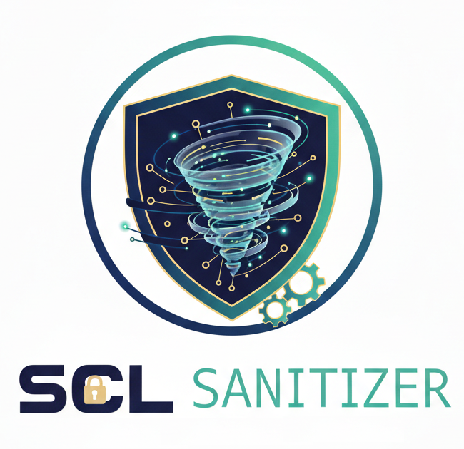

# scl-sanitizer
Open source application for anonymizing IEC 61850 SCL instance files

  
\[[GitHub Repo](https://github.com/cimug-org/scl-sanitizer)\]

**SCL Sanitizer** is an open source tool for for anonymizing IEC 61850 SCL instance files.
